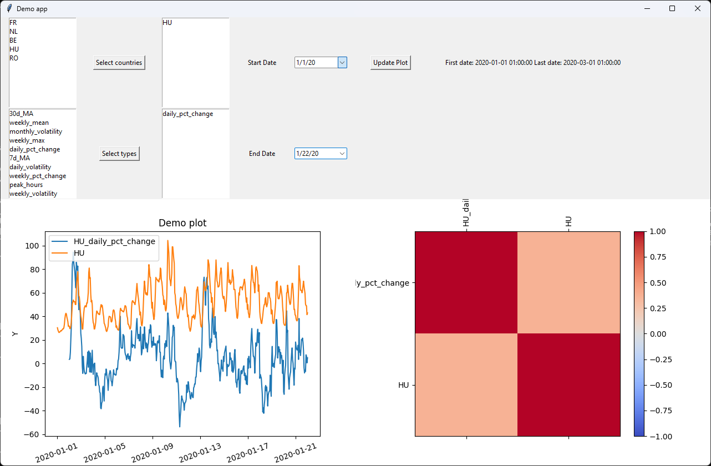

# Demo app for energy price data processing

This is a demonstration application designed for processing energy price data. Developed in Python, the app utilizes tkinter for its user interface.
The dataset used is a simplified example, focusing on Hungarian electricity prices between January 1, 2020, and March 1, 2020. <br>
Created by Botond Bendegúz PROHÁSZKA in 2024.
 
 ---

# Table of contents
1. [Introduction](#introduction)
2. [Installation](#installation)
3. [Usage](#usage)

## Introduction <a name="introduction"></a>
This application serves as a demonstration for processing energy price data. It retrieves information from [ENTSO-E](https://www.entsoe.eu) using the [entsoe-py](https://github.com/EnergieID/entsoe-py) library. The provided demo scripts facilitate downloading, processing, and displaying the data. The app incorporates a simple interface that enables users to select column types for a specific country and time period to visualize the data effectively."

## Installation <a name="installation"></a>
1. Clone the repository:
```bash
git clone <repo-url>
```
2. Change to the directory of the repository:
```bash
cd <repo-location>
```
3. Install the required libraries:
```bash
pip install -r requirements.txt
```

## Usage <a name="usage"></a>

Before usage you may  want to change the API key. You can do it in two different ways.
1. Add your API key to your system environment variables with the name `ENTSOE_API_KEY`.
2. Set your API key in `data_collection/collect_data.py` file in the `API_KEY` variable ([this line](data_collection/collect_data.py#L16)):
```python
API_KEY = None # Set your API key here
```

---

1. Change to the directory of the [data_collection](data_collection) folder:
```bash
cd data_collection
```
2. Run the [collect_data.py](data_collection/collect_data.py) script:
```bash
python collect_data.py
```
3. Change to the directory of the [data_processing](data_processing) folder:
```bash
cd ../data_processing
```
4. Run the [process_data.py](data_processing/process_data.py) script:
```bash
python process_data.py
```
5. Change to the directory of the [ui](ui) folder:
```bash
cd ../ui
```
6. Run the [app.py](ui/app.py) script:
```bash
python app.py
```

The app will start and you can select the country and time period to display the data.

### How to use the app:
- You can select countries and data types from the Listboxes. After you selected the countries press the `Select countries` button, and same for the types.
- After selecting you will see the selected columns next to the button.
- You can select the time period by selecting the start and end date from the calendars. The default values are the first and last date of the dataset.
- To show or update the selected columns press the `Update plot` button. **All selected column types will appear for each selected country.** The selected country's price data will also be displayed on the plot (labeled by the 2 county code).
- To clear the plot press the `Select countries` and `Select types` buttons again without selecting anything.

## Image of the app:

